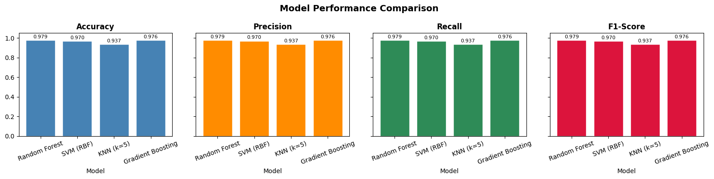

# Hand Gesture Classification Using MediaPipe Landmarks

A machine learning pipeline that classifies **18 hand gestures** from 21 MediaPipe hand landmarks extracted from the [HaGRID dataset](https://github.com/hukenovs/hagrid). Four sklearn classifiers are trained and compared; the best model is saved for deployment in real-time webcam and video inference.

---

## Dataset

| Property | Value |
|---|---|
| Source | HaGRID (Hand Gesture Recognition Image Dataset) |
| Samples | 25,675 |
| Features | 63 (21 landmarks × x, y, z) |
| Classes | 18 gesture types |
| Missing values | 0 |

**18 Gesture Classes:**
`call` · `dislike` · `fist` · `four` · `like` · `mute` · `ok` · `one` · `palm` · `peace` · `peace_inverted` · `rock` · `stop` · `stop_inverted` · `three` · `three2` · `two_up` · `two_up_inverted`

The dataset is roughly balanced (~945–1,653 samples per class).

---

## Pipeline

1. **Load** — Read landmark CSV (63 features + label)
2. **Normalize** — Recenter to wrist, scale by distance to middle-finger tip
3. **Split** — 80% train / 20% test (stratified)
4. **Train** — 4 models, each wrapped in a `StandardScaler → Classifier` pipeline
5. **Evaluate** — Compare accuracy, precision, recall, F1 on the test set
6. **Deploy** — Save best model; run live inference via webcam or video file

---

## Model Comparison

### Results on Test Set (20% hold-out, stratified)

| Model | Accuracy | Precision | Recall | F1-Score |
|---|---|---|---|---|
| **Random Forest** | **0.979** | **0.979** | **0.979** | **0.979** |
| SVM (RBF) | 0.970 | 0.970 | 0.970 | 0.970 |
| Gradient Boosting | 0.976 | 0.976 | 0.976 | 0.976 |
| KNN (k=5) | 0.937 | 0.937 | 0.937 | 0.937 |

> All metrics are weighted averages across all 18 classes.

### Model Performance Comparison



---

## Best Model — Random Forest

Per-class F1-scores on the test set:

| Gesture | Precision | Recall | F1 | Support |
|---|---|---|---|---|
| call | 0.99 | 0.99 | 0.99 | 301 |
| dislike | 1.00 | 1.00 | 1.00 | 259 |
| fist | 0.99 | 0.99 | 0.99 | 189 |
| four | 0.98 | 0.99 | 0.98 | 327 |
| like | 0.99 | 0.99 | 0.99 | 287 |
| mute | 0.96 | 0.97 | 0.97 | 217 |
| ok | 0.99 | 0.99 | 0.99 | 318 |
| one | 0.94 | 0.97 | 0.96 | 253 |
| palm | 0.99 | 0.98 | 0.98 | 330 |
| peace | 0.98 | 0.95 | 0.96 | 288 |
| peace_inverted | 0.98 | 0.97 | 0.98 | 299 |
| rock | 0.99 | 0.98 | 0.99 | 292 |
| stop | 0.94 | 0.97 | 0.96 | 296 |
| stop_inverted | 0.98 | 0.98 | 0.98 | 314 |
| three | 0.99 | 0.97 | 0.98 | 291 |
| three2 | 0.99 | 0.99 | 0.99 | 331 |
| two_up | 0.97 | 0.98 | 0.97 | 269 |
| two_up_inverted | 0.96 | 0.97 | 0.97 | 274 |
| **weighted avg** | **0.98** | **0.98** | **0.98** | **5135** |

---

## Project Structure

```
Hand_Gesture/
├── hand_gesture_classification.ipynb   # Main notebook (full pipeline)
├── hand_landmarks_data.csv             # Dataset (63 features + label)
├── best_gesture_model.pkl              # Saved Random Forest pipeline
├── label_encoder.pkl                   # Saved LabelEncoder
├── hand_landmarker.task                # MediaPipe Tasks API model
├── pyproject.toml                      # Python dependencies (uv)
└── uv.lock
```

---

## Setup

**Requirements:** Python ≥ 3.11, [uv](https://github.com/astral-sh/uv)

```bash
# Clone and install dependencies
git clone <repo-url>
cd Hand_Gesture
uv sync
```

---

## Usage

### Run the full pipeline

Open and run all cells in `hand_gesture_classification.ipynb`:

```bash
uv run jupyter notebook hand_gesture_classification.ipynb
```

This will:
1. Load and visualize the dataset
2. Normalize landmarks
3. Train all 4 models
4. Evaluate and compare them
5. Save `best_gesture_model.pkl` and `label_encoder.pkl`

### Real-time webcam inference

Run **Section 7b** in the notebook. Requires a connected webcam.

```
Press Q in the video window to quit.
```
