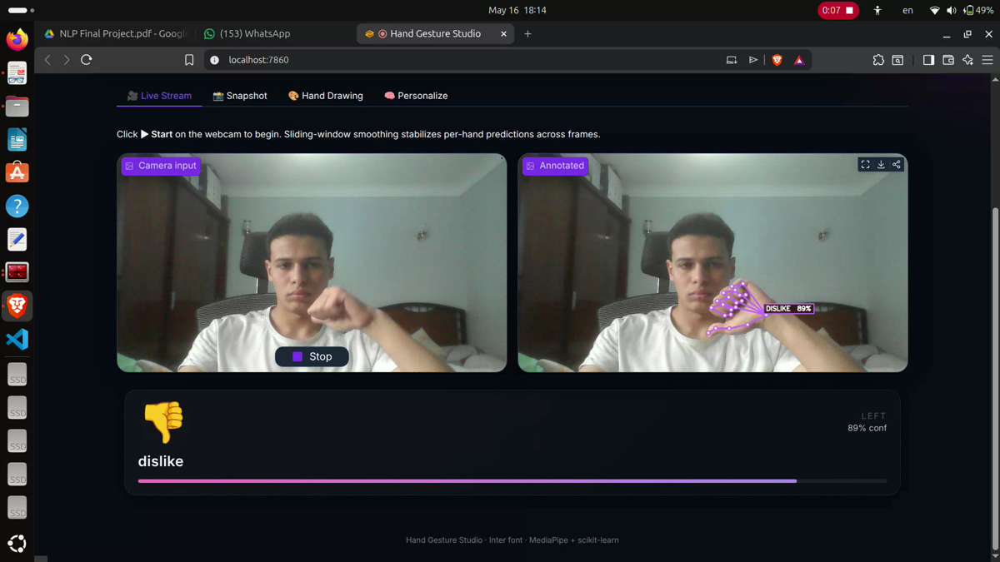
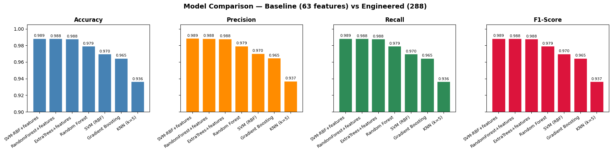
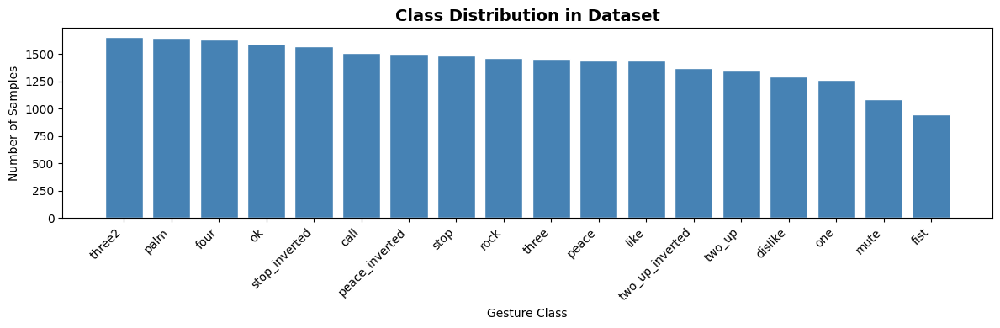
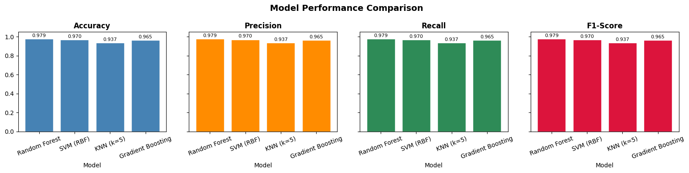
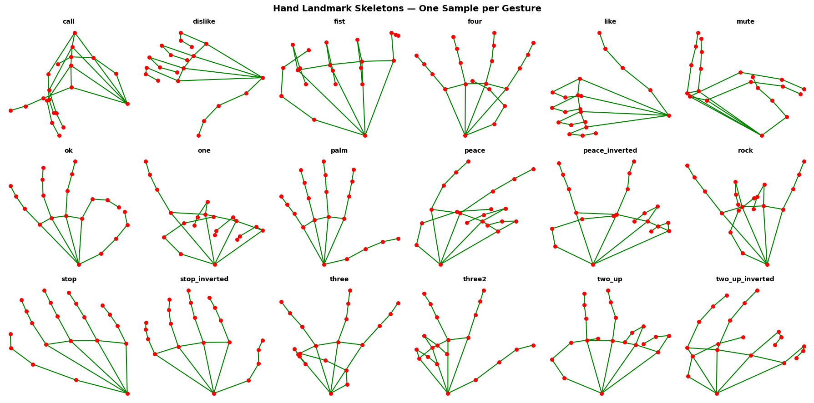
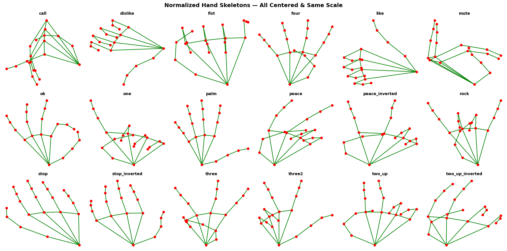
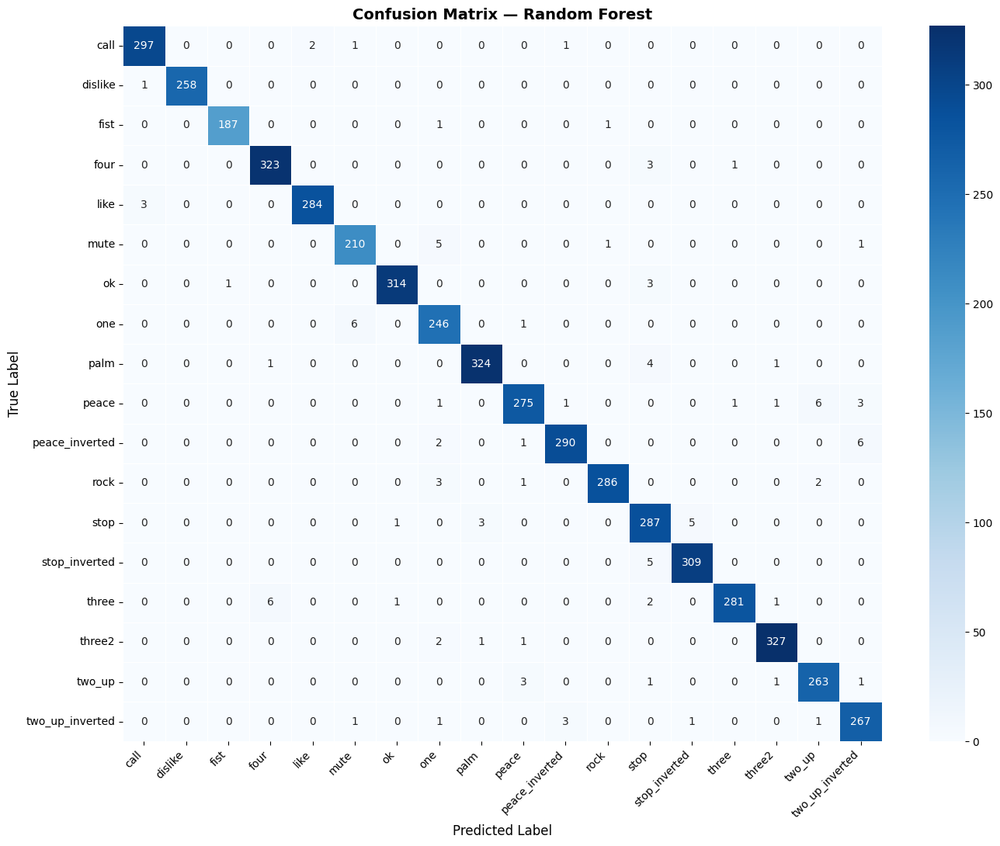
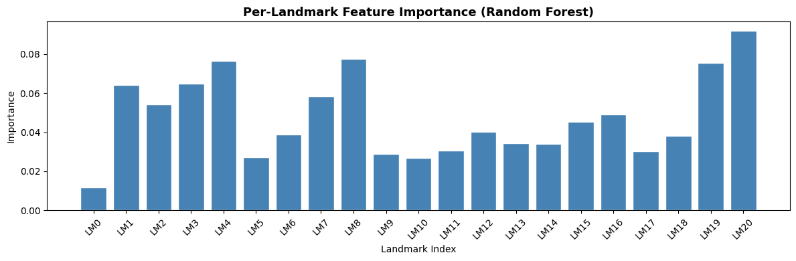

# Hand Gesture Studio

[](https://github.com/OmarGamal488/hand-gesture-recognition/actions/workflows/ci.yml)
[](https://www.python.org/)
[](https://github.com/astral-sh/uv)
[](https://docs.astral.sh/ruff/)
[](tests/)
[](README.md#model-comparison)
[](README.md#dataset)

[](https://developers.google.com/mediapipe)
[](https://scikit-learn.org/)
[](https://mlflow.org/)
[](https://fastapi.tiangolo.com/)
[](https://gradio.app/)
[](https://docs.docker.com/)

Real-time classification of **18 hand gestures** from MediaPipe landmarks,
trained on the [HaGRID dataset](https://github.com/hukenovs/hagrid) and shipped
as a polished webcam app, a REST API, an MLflow registry, and a Docker stack.

**🎥 Demo** — 98-second walkthrough of all four tabs:

https://github.com/user-attachments/assets/06d56ee9-b05d-4df8-9136-c33817c9e376



---

## Highlights

- **0.9885 test F1** on 18 classes with an SVM-RBF over 288 engineered features
  (raw coords + pairwise distances + finger-joint angles). +0.95 pp over the
  baseline Random Forest.
- **Hand Gesture Studio (Gradio)** — dark glassmorphism UI with four tabs:
  Live Stream · Snapshot · Hand Drawing (pinch-to-draw canvas) · Personalize.
- **FastAPI service** — `/predict`, `/predict_image`, `/predict_image_all`
  (multi-hand + handedness), `/classes`, `/health`. Auto-generated docs at
  `/docs`.
- **MLflow integration** — every training run logs metrics, params, artifacts;
  best model promoted to `champion` alias automatically.
- **Personalization** — record your own samples per label and train a personal
  SVM with sample-weight=8 boosting your data.
- **Production-grade hand tracking** — MediaPipe `VIDEO` mode with monotonic
  timestamps, OneEuro adaptive smoother, and a defensive image-format
  validator (training-consistent RGB uint8 contiguous).
- **One-command ops** — `./start.sh` brings up API + UI + MLflow; `./stop.sh`
  shuts them down. Docker compose works too.
- **Tested + CI** — pytest suite (features, inference, API) + GitHub Actions
  + ruff linting.

---

## Dataset

| Property | Value |
|---|---|
| Source | HaGRID (Hand Gesture Recognition Image Dataset) |
| Samples | 25,675 |
| Raw features | 63 (21 landmarks × x, y, z) |
| Engineered features | **288** = 63 raw + 210 pairwise distances + 15 joint angles |
| Classes | 18 gesture types |
| Missing values | 0 |

**18 Gesture Classes:**
`call` · `dislike` · `fist` · `four` · `like` · `mute` · `ok` · `one` ·
`palm` · `peace` · `peace_inverted` · `rock` · `stop` · `stop_inverted` ·
`three` · `three2` · `two_up` · `two_up_inverted`

---

## Pipeline

```
HaGRID images
   │
   ▼
MediaPipe HandLandmarker  →  hand_landmarks_data.csv  (63 raw coords + label)
   │
   ▼
normalize (wrist origin, mid-finger-tip scale)
   │
   ▼
featurize (288: raw 63 + 210 pairwise dists + 15 joint angles)
   │
   ▼
Pipeline(StandardScaler → SVM-RBF / RF / ExtraTrees)
   │
   ▼
MLflow registry · best_gesture_model.pkl
   │
   ▼
FastAPI · Gradio Studio · Docker
```

---

## Model Comparison

### Baseline — raw 63 features (notebook)

| Model | Accuracy | F1 |
|---|---|---|
| Random Forest | 0.979 | 0.979 |
| Gradient Boosting | 0.976 | 0.976 |
| SVM (RBF) | 0.970 | 0.970 |
| KNN (k=5) | 0.937 | 0.937 |

### Improved — 288 engineered features (`model.py`)

| Model | Accuracy | F1 | Train time |
|---|---|---|---|
| **SVM-RBF (C=20)** | **0.9885** | **0.9885** | 7.8 s |
| Random Forest (n=400) | 0.9883 | 0.9883 | 6.3 s |
| Extra Trees (n=400) | 0.9879 | 0.9879 | 1.3 s |

`best_gesture_model.pkl` is the **SVM-RBF + 288 features** pipeline. Net gain
over the baseline RF: **+0.0095 F1**. All metrics are weighted across 18
classes on a stratified 20% held-out split (5,135 samples).



### Per-class F1 (champion model, 288 features)

| Gesture | F1 | Gesture | F1 | Gesture | F1 |
|---|---|---|---|---|---|
| call | 0.99 | mute | 0.97 | stop | 0.98 |
| dislike | 0.99 | ok | 0.99 | stop_inverted | 0.99 |
| fist | 0.99 | one | 0.97 | three | 0.99 |
| four | 0.99 | palm | 0.99 | three2 | 0.99 |
| like | 0.99 | peace | 0.99 | two_up | 0.99 |
| peace_inverted | 1.00 | rock | 0.99 | two_up_inverted | 0.99 |

Worst confused pairs (from `analyze_errors.py`): `one↔mute`, `stop↔palm`,
`call↔like`. 58 errors out of 5,135 test samples.

### Notebook visualizations

The full pipeline notebook (`notebooks/hand_gesture_classification.ipynb`)
regenerates these on every run:

<table>
<tr>
<td width="50%"></td>
<td width="50%"></td>
</tr>
<tr>
<td colspan="2" align="center"><b>Class balance</b> (1,000–1,700 per class) · <b>Per-metric comparison</b> across the four baseline classifiers (63 raw features)</td>
</tr>
<tr>
<td width="50%"></td>
<td width="50%"></td>
</tr>
<tr>
<td colspan="2" align="center"><b>Before / after wrist-centered normalization</b> — every gesture's skeleton now sits at a common origin and scale before features are computed</td>
</tr>
<tr>
<td colspan="2"></td>
</tr>
<tr>
<td colspan="2" align="center"><b>Confusion matrix (Random Forest baseline)</b> — diagonal-dominant, residual confusions concentrated in <code>one↔mute</code>, <code>stop↔palm</code>, and the <code>peace</code> family</td>
</tr>
<tr>
<td colspan="2"></td>
</tr>
<tr>
<td colspan="2" align="center"><b>Per-landmark feature importance</b> (Random Forest) — fingertips (LM 4/8/12/16/<b>20</b>) dominate; wrist (LM 0) is almost zero, which is expected since we normalize relative to it</td>
</tr>
</table>

---

## Hand-Tracking Quality

Several improvements that don't change the model but make the live UX much
better:

| Improvement | Where | Effect |
|---|---|---|
| MediaPipe `RunningMode.VIDEO` with monotonic timestamps | `inference.py:get_landmarker` | Reuses tracking between frames; smoother bounding box, faster, fewer drop-outs |
| OneEuro adaptive landmark smoother | `inference.py:OneEuroLandmarkSmoother` | Halves stationary-noise stddev while still snapping to fast motion (≤0.1 lag on a 10-frame ramp) |
| Per-hand smoother state, keyed by handedness | `inference.py:_get_smoother` | Left/Right filters don't bleed into each other; auto-reset after 0.4 s of absence |
| Tuned confidence thresholds (detection 0.4, presence 0.4, tracking 0.5) | `inference.py:get_landmarker` | Recovers faster after occlusion |
| Defensive format validator | `inference.py:_ensure_mp_image_format` | Forces RGB uint8 contiguous before MediaPipe (training distribution match) |
| EMA fingertip smoothing + pinch detection | `gradio_app.py:predict_draw` | Cursor for the drawing canvas; pinch = `‖coords[4]-coords[8]‖ < 0.35` |

The Drawing tab's selfie-view mirror is **display-only** — classification and
pinch detection always see the un-mirrored frame so the model gets the same
distribution it was trained on.

---

## Gradio UI — Hand Gesture Studio

```bash
uv run python gradio_app.py            # http://localhost:7860
```

Camera-only (no image uploads). Dark violet/fuchsia theme on Inter, with
per-hand "glass" cards showing a large emoji, confidence bar, and handedness.

### Tabs

- **🎥 Live Stream** — continuous multi-hand classification with sliding-window
  smoothing. Predicts on ~5 FPS; shows top-3 confidences.
- **📸 Snapshot** — capture a single frame, then **Predict**. Useful for posed
  shots when you want the raw model output without smoothing.
- **🎨 Hand Drawing** — pinch-to-draw canvas:
  - 🤏 pinch thumb + index → pen down (cursor follows index fingertip, EMA-smoothed)
  - ✋ open the pinch → pen up
  - ☝️ 2️⃣ 3️⃣ 4️⃣ `one` / `two_up` / `three` / `four` → select color slot 1–4
  - ✌️ `peace` → cycle pen color
  - 🤘 `rock` → undo last stroke
  - 👍 `like` → save canvas to `saved_canvases/canvas_<ts>.png`
  - ✋ `palm` → clear canvas
  - All action triggers are debounced (4 stable frames) **and gated on
    pen-up**, so they can never fire mid-stroke even if the classifier
    briefly mislabels your pinch.
  - Buttons: ↩ Undo · 🗑️ Clear · 💾 Save PNG (downloadable).
- **🧠 Personalize** — record landmark samples per label, then **Train Personal
  Model**. Personal rows are weighted **8×** during training. Toggle
  **Use my personal model** at the top to switch the whole app to your
  personal SVM.

All tabs share a **confidence threshold slider**; predictions below it
display as `❓ unknown` rather than guessing.

---

## FastAPI Service

```bash
uv run uvicorn api.main:app --reload --port 8000
# Interactive docs: http://localhost:8000/docs
```

| Method | Path | Body / Params | Returns |
|---|---|---|---|
| `GET`  | `/health` | — | model status, feature count, default threshold |
| `GET`  | `/classes` | — | list of 18 gesture labels |
| `POST` | `/predict` | `{"landmarks": [...×21], "threshold": 0.6}` | label + top-3 (label = `"unknown"` if below threshold) |
| `POST` | `/predict_image` | multipart image upload, `?threshold=` | single-hand: runs MediaPipe + predicts |
| `POST` | `/predict_image_all` | multipart, `?threshold=&num_hands=2` | list of predictions, one per detected hand (with handedness) |

```bash
curl http://localhost:8000/health
curl -X POST "http://localhost:8000/predict_image_all?threshold=0.7" \
     -F "file=@some_hand.jpg"
```

---

## MLflow Experiment Tracking

All training runs are logged to the `hand-gesture-classification` experiment
via `mlflow_utils.py`. Each run records:

- **Params** — classifier type, hyperparameters, feature set tag, augmentation flag
- **Metrics** — accuracy, precision, recall, F1
- **Artifacts** — dataset summary CSV, comparison chart, the full sklearn pipeline
- **Tags** — `model_name`, `best_model`, `feature_set`, `augmented`

The best model is auto-registered as `hand-gesture-classifier` with the
`champion` alias. Other candidates get archived aliases.

```bash
uv run mlflow ui                                  # http://127.0.0.1:5000
```

```python
import mlflow.sklearn
model = mlflow.sklearn.load_model("models:/hand-gesture-classifier@champion")
```

---

## Personalization

```bash
# (Through the Gradio Personalize tab — recommended.)
# Or programmatically:
uv run python -c "from personalize import train_personal_model; print(train_personal_model())"
```

- Samples saved to `personal_landmarks.csv` (same column layout as the base CSV)
- Trained model: `personal_gesture_model.pkl` + `personal_label_encoder.pkl`
- Trained with `sample_weight = 8` on personal rows so your data shifts the
  decision boundary even though you only have ~30 samples per label

---

## Setup

**Requirements:** Python ≥ 3.11, [uv](https://github.com/astral-sh/uv)

```bash
git clone https://github.com/OmarGamal488/hand-gesture-recognition.git
cd Hand_Gesture
uv sync
```

---

## Start / Stop the Stack

```bash
./start.sh                       # FastAPI + Gradio + MLflow (background)
./start.sh --no-mlflow           # skip MLflow UI
./start.sh --no-ui               # skip Gradio
./start.sh --no-api              # skip FastAPI
./start.sh --docker              # use docker compose instead
./stop.sh                        # graceful stop
./stop.sh --clean                # also remove .run/ logs + pidfiles
```

Logs land in `.run/*.log`, PID files in `.run/*.pid`.

`start.sh` invokes processes via `$VENV/bin/python -m <module>` to bypass
any stale shebangs in the venv's console scripts (we hit this when the
`.venv` was created at a different path and reused).

---

## Docker

```bash
docker compose up -d --build
# api    → http://localhost:8000
# ui     → http://localhost:7860
# mlflow → http://localhost:5000
docker compose down
```

Single image, three entrypoints (`api`, `ui`, `mlflow`) via
`docker-entrypoint.sh`.

---

## Tests + CI

```bash
uv run pytest tests/ -q          # 15 tests
uv run ruff check .              # lint
```

Test coverage:
- `tests/test_features.py` — shape, rotation invariance, NaN-free outputs
- `tests/test_inference.py` — model loading, threshold → unknown, normalization
- `tests/test_api.py` — health, classes, predict, threshold, error paths

GitHub Actions (`.github/workflows/ci.yml`) runs ruff + pytest on every push
to `main` / `research` and on PRs.

---

## Training & Diagnostics

### Train the improved model

```bash
uv run python model.py                  # 288-feature pipeline + MLflow
uv run python model.py --augment        # + rotation + jitter augmentation
uv run python model.py --no-mlflow      # skip registry logging
```

Outputs: `improved_metrics.json`, `improved_gesture_model.pkl`, and (if
better than baseline) refreshes `best_gesture_model.pkl`. In our experiments,
rotation augmentation slightly *hurts* (0.9885 → 0.9875) because the distance
+ angle features are already rotation-invariant — kept as an opt-in flag.

### Error analysis

```bash
uv run python analyze_errors.py
```

Writes `errors.csv`, `per_class_summary.csv`, and `confused_pairs.png`.
58/5135 test errors on the current champion (98.87% accuracy).

### Notebook (full original pipeline)

```bash
uv run jupyter notebook hand_gesture_classification.ipynb
```

---

## Project Structure

```
Hand_Gesture/
├── README.md
├── start.sh · stop.sh                  # User-facing service management
├── pyproject.toml · uv.lock · ruff.toml · .python-version
│
├── src/                                # All Python source code
│   ├── features.py                     # 288-feature engineering (dists + angles)
│   ├── augmentations.py                # Landmark-space rotation + jitter
│   ├── inference.py                    # MediaPipe (VIDEO) + OneEuro + GestureModel
│   ├── mlflow_utils.py                 # MLflow tracking & registry helpers
│   ├── personalize.py                  # Personal-sample recording + training
│   ├── model.py                # Re-trains with engineered features
│   ├── analyze_errors.py               # Misclassification analysis
│   ├── gradio_app.py                   # Gradio Studio UI (4 tabs)
│   └── api/main.py                     # FastAPI service
│
├── notebooks/
│   └── hand_gesture_classification.ipynb
│
├── tests/                              # pytest suite (15 tests)
│   ├── test_features.py
│   ├── test_inference.py
│   └── test_api.py
│
├── data/                               # ↓ gitignored ↓
│   └── hand_landmarks_data.csv         # Dataset (63 features + label)
│
├── models/                             # gitignored
│   ├── best_gesture_model.pkl          # Champion (SVM-RBF, 288 features)
│   ├── improved_gesture_model.pkl
│   ├── label_encoder.pkl
│   ├── hand_landmarker.task            # MediaPipe Tasks model
│   ├── personal_gesture_model.pkl      # Personal SVM (if trained)
│   └── personal_label_encoder.pkl
│
├── outputs/                            # gitignored
│   ├── mlflow.db · mlruns/             # MLflow tracking store
│   ├── saved_canvases/                 # Drawings from the canvas
│   ├── improved_metrics.json
│   ├── errors.csv
│   ├── per_class_summary.csv
│   └── confused_pairs.png
│
├── deploy/
│   ├── Dockerfile
│   ├── docker-compose.yml
│   └── docker-entrypoint.sh
│
├── docs/
│   ├── model_comparison.png
│   ├── readme_imgs/                    # README screenshots + hero
│   └── Project Description.pdf
│
└── .github/workflows/ci.yml            # Lint + tests on every push
```
